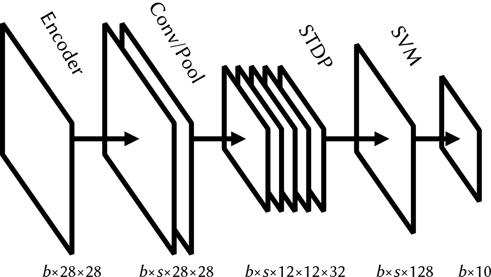
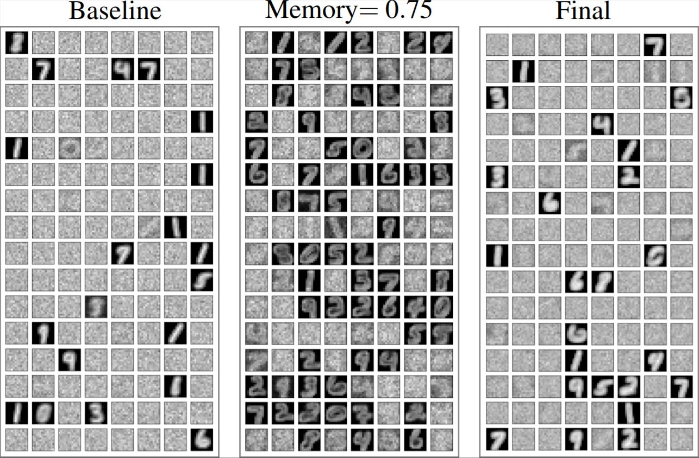

# NeuroComp

Project repository for the 2021 version of the Neuromorphic Computing course.

We tried to reproduce the spiking CNN of [Tavanaei and Maida [2017]](https://arxiv.org/abs/1611.03000) and extend it by changing the model architecture and hyperparameters.

The accuracies reported by the 2017 paper could not be reproduced, but we did find some interesting but unintuitive results when combining promising extensions. The number of active neurons of the STDP layer seems to have a large effect on the effectiveness of the model, but it is very difficult to control.

This repository uses the scikit-learn interfaces for training the models. The baseline model can be found in `main.py`, where most figures as shown in the paper are shown during training. A different architecture can easily be trained by adding or exchanging layers.

The models reported in the paper can be retrained with `retrain.py` and evaluated on the validation split with `eval.py`. Use `pip install -r requirements.txt` to install the requirements before running the code.
___

## READ THIS FOR TESTING

## Baseline model by layer

1. **Stochastic**
2. **Conv** (size=5, filter_count=32, memory=0.0, euclid_norm=False, uniform_norm=True, weight_init='uniform')
3. **Pool**
4. **STDP** (memory=0.0, neuron_count=128)
5. **SVM**

## List of tests we want to run

We assume individual modifications to the base model, so we run tests on the baseline model with a single hyperparameter changed each time.

Pick a test and start training; once it is done, upload the model file to `models/` with an appropriate name. Evaluate on the entire validation set, and put the accuracy in the table below. Edit this file and surround the test you are currently working on with `~~` (strikethrough) symbols, that way we can track progress.

- **Convolutional kernel size**: ~~3~~, ~~5~~, ~~7~~
- **Memory constant (conv/stdp layer)**: ~~0.0~~, ~~0.25~~, ~~0.368~~ ~~0.5~~, ~~0.75~~, ~~0.905~~, ~~1.0~~
- **uniform_norm**: ~~True~~, ~~False~~
- **Convolutional learning rule**: ~~Std~~, ~~Oja~~, ~~BCM~~, ~~STDP~~
- **STDP neuron count**: ~~64~~, ~~128~~, ~~256~~
- **Second conv+pool layers**: same parameters as first conv layer, except size: try kernel sizes ~~3~~, ~~5~~, or ~~7~~.
- **Convolutional weight initialization**: ~~uniform~~, ~~gaussian~~, ~~glorot~~, ~~gabor_uniform~~, ~~gabor_normal~~

## Put your accuracies down here

| Parameters            | Accuracy |
|:----------------------|---------:|
| baseline | 0.9235 |
| filter_size=3 | 0.9170 |
| filter_size=7 | 0.9188 |
| filter_count=16 | 0.9215 |
| filter_count=64 | 0.9304 |
| memory=0.25 | 0.9459 |
| memory=0.368 | 0.9521 |
| memory=0.5 | 0.8952 |
| memory=0.75 | 0.9606 |
| memory=0.905 | 0.9570 |
| memory=1.0 | 0.9562 |
| norm=false | 0.4445 |
| lr=oja | 0.9407 |
| lr=bcm | 0.8546 |
| lr=stdp | 0.8767 |
| stdp_count=64 | 0.9015 |
| stdp_count=256 | 0.9235 |
| conv_conv-32,3 | 0.8759 |
| conv_conv-32,5 | 0.8004 |
| conv_conv-32,7 | 0.6343 |
| conv_init=norm | 0.9253 |
| conv_init=gluni | 0.9115 |
| conv_init=glnorm | 0.9207 |
| no conv/pool | 0.9308 |
| no stdp | 0.9824 |
| no conv/pool/stdp | 0.969 |
